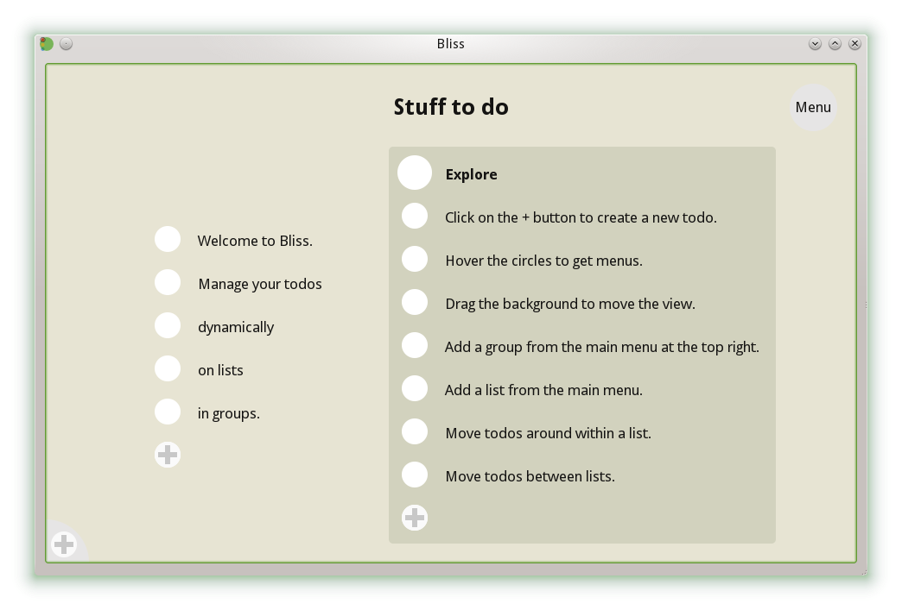

# Bliss

Bliss is a small app to manage todos. It's a bit different than the traditional todo list. It provides a canvas for spatial orientation where you can put your todo items arranged in groups and lists. These can be freely arranged and moved around to allow for many different approaches how to manage your todos, classical todo, personal kanban, round-robin bucket carousel, or whatever else you prefer.

Bliss is a native cross-platform desktop app and looks like this:

You can read more about the concepts behind Bliss in my blog [Experimenting with user interfaces for todo lists](https://blog.cornelius-schumacher.de/2013/06/experimenting-with-user-interfaces-for.html).

## Technical info

Bliss is a C++ application using Qt as UI toolkit. It uses Qt's QGraphicsView stack to provide a dynamic and fluid user interface. Data is stored in an XML format and is automatically versioned via git.

To build it, install Qt, run `qmake` and then `make`.

There is some [API documentation](http://cornelius.github.io/bliss/) of libgitdata, the backend library handling the versioned storage.

## Status

While not a terribly active project, Bliss is stable and can work in production scenarios. It is an experiment and personal side project. Don't expect too much, but feel free to experiment yourself.

Contributions are welcome, no guarantees about if and when I find the time to review them, though.

Bliss is maintained by me, Cornelius Schumacher <schumacher@kde.org>.

## License

Bliss is published under [GPL-2.0-or-later](COPYING).
